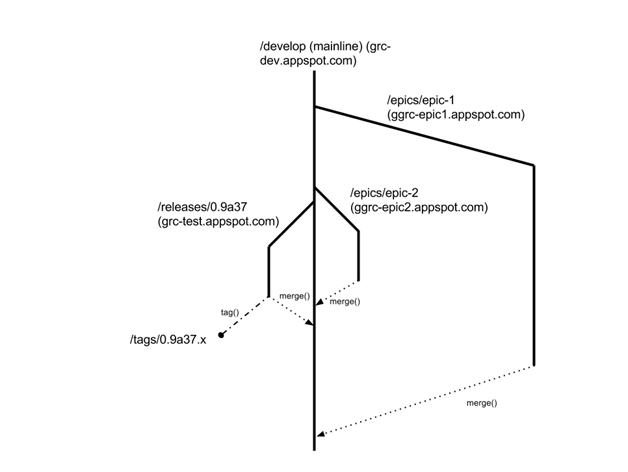

# Git branch management

The basic idea is this. We want one branch for mainline, fast and furious
development, another branch for incremental changes to an upcoming release,
and one branch per epic.

## Develop Branch (develop)

*The develop (main) branch is the 65MPH (105KPH) zone. Development in this
branch is fast and furious with many contributors.*

This is the default branch for the developers to open pull requests against.
Work in develop is work that is not scheduled for the upcoming release. If
it's not scheduled for the upcoming release, it should go into develop (unless
it's an epic, which we'll talk about below).

## Feature Branches

Feature branches are used for creating pull requests against develop. When
the changes are reviewed, they are merged into develop by the reviewer.

The base for a feature branch is always the current develop branch:

    git checkout origin/develop -b new-feature

Because feature branches are only on repo forks, we don't have strict naming
policy, but suggestions are as follows:

 - Branches created for a specific ticket should start with ticket id and
   optional description (CORE-123, CORE-456-update-documentation)
 - Quickfix branches should have a "quickfix-"  prefix

## Release Branch (release/*)

*The release branch is like an off-ramp from the highway. Work in this branch
is "polish" work to get a release ready to deliver. Progressively fewer
commits go into this branch as the release gets more stable and developers
progressively, individually transition to working on the next release. Again,
the work in this branch is more for bug fixes and "polish" work and less for
major feature work. When you start the release branch work will still be fast
and furious. As the features and fixes scoped for the specific release are
completed the pace of work will slow down and eventually stop, when a release
candidate is bug free and all required features and fixes are complete.*

Developers open pull requests against this branch ONLY if the story they are
working on is scheduled (via the JIRA FixVersion field) for the upcoming
release.

We always want to have exactly one active release branch.

The release branch should be "swapped" when a release is accepted as final.
This means that the release/N+1 branch should be created at the same time that
release/N is tagged as the shippable release candidate.

When needed, hotfixes can be made to a release that has already shipped. For
this reason, release branches for releases that have already shipped should be
kept around after they are released.

Changes made to release are periodically merged back into develop. Release
branch should never be ahead of develop.

Release branches are never deleted.

## Hotfix Branches (hotfix/*)

Hotfix branches are used for creating pull requests against release. When the
changes are reviewed, they are merged into release **AND** develop by the
reviewer. This can easily be accomplished by opening a new pull request from
release to develop when the changes are merged. The reviewer is also
responsible for deleting the hotfix branch after the changes are merged.

The base for a hotfix branch is always the current release branch:

    git checkout origin/release/x.x.x -b hotfix/new-hotfix

## Epic Branches (epic/*)

One branch per epic. These branches allow large work items to be developed in
isolation over multiple sprints without putting either the main or release
branch in an inconsistent and intermediate state.

The difference between epic and feature branches is that epic branches have
their own appengine instance while feature branches do not. Having their own
App Engine instance allows acceptance testing on the epic while the work
progresses. Then, when the epic work is complete, there is reasonable
assurance (provided that QA was done on the epic work) that the work is stable
and satisfies acceptance criteria before it is merged back into develop.

**Develop, Release and Epic branches are deployed to their own App Engine
instance.**

## Tagging

We tag release branches after QA is finished and we are ready to deploy to
production. The name of the tag should include the full version number (e.g.
`v0.9.0.6591`).

