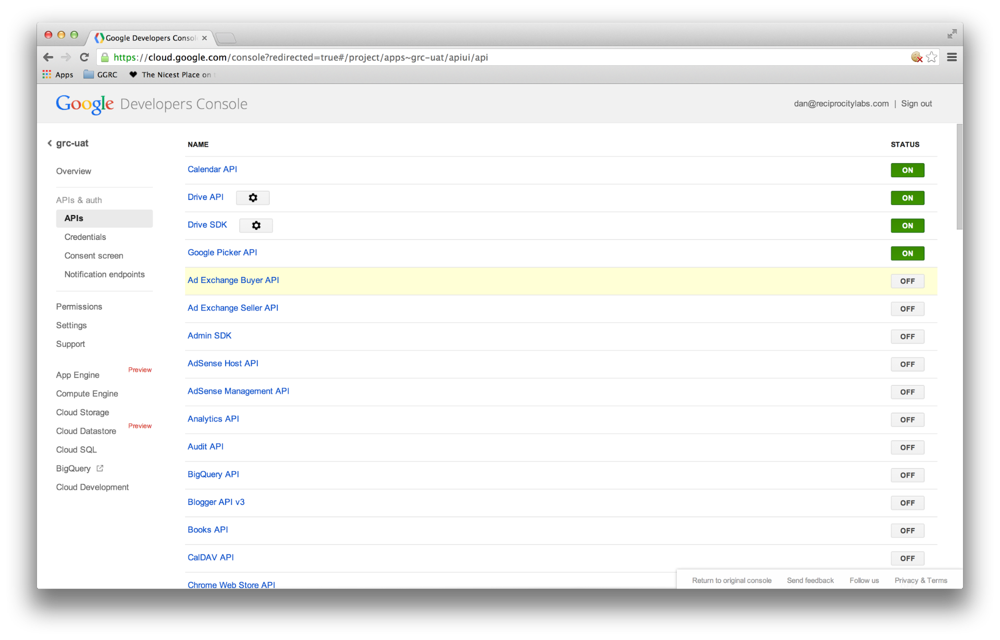
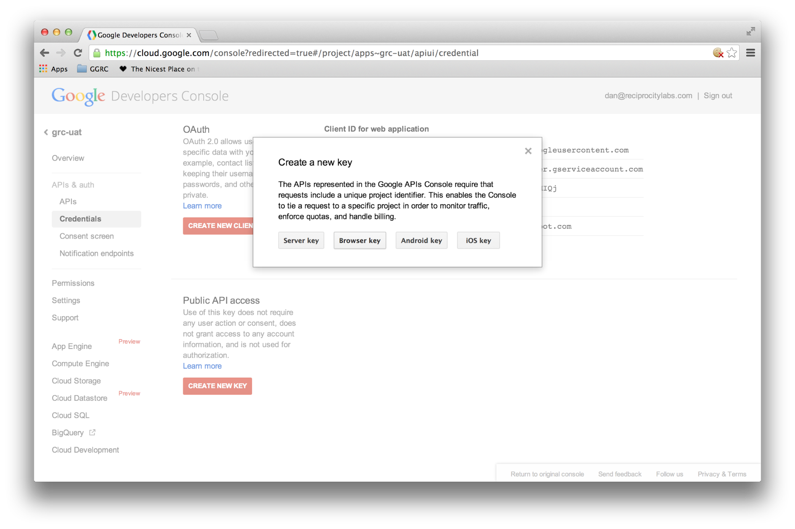
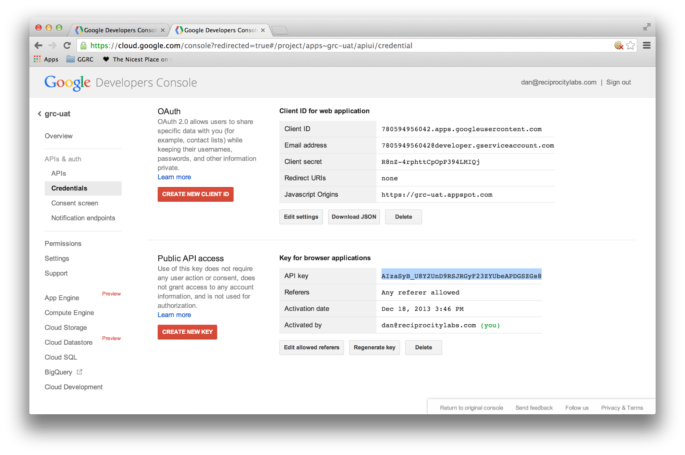
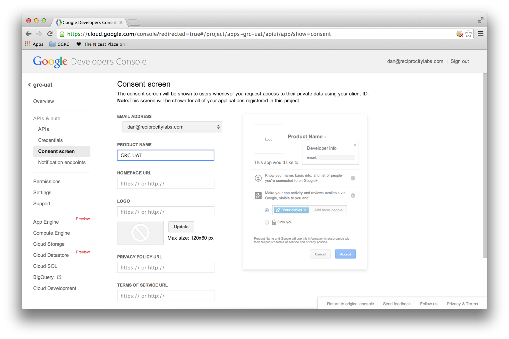

# GGRC Deployment and Update Steps

## Upgrading a GGRC deployment

TODO (Please add any questions or clarification requests here):

1. Add a summary of deployment-specific values (e.g., filename of deployment settings file, filename of `ggrc/settings/*` file) and/or use some convention to denote these as variable in this document

2. Add a CHANGELOG’ or version/upgrade matrix in steps 2 and 3 (and 5, for settings modules) to make it clear when the step must be repeated or more closely examined (or which values/APIs have changed)

3. Add note about how to verify backup in Cloud Storage

4. Update `deploy_appengine` to (optionally) handle migrations -- environment variables and database settings are too opaque and error-prone.  Could also have it check and warn about valid settings in settings files, maybe?  At least several “verify this value” steps for database and App Engine instance name.

### 0. Complete initial development environment setup

This step should only need to be done once per deployment machine, following instructions in the main [README](README.md).

### 1. Start and connect to the virtual machine (if necessary):

    # Change to the directory of the project repository
    vagrant up
    # Wait until VM boot completes
    vagrant ssh  # or SSH into localhost:2222 with your favorite SSH client

### 2. Create/Update deployment settings file(s).

By convention, this file will be called `deploy_settings_<something>.sh` where `<something>` is the name of the deployment instance.  This file should not be part of the repository, as it is deployment-specific.  There is, however, an example file in the repository at [`extras/deploy_settings_local.sh`](../extras/deploy_settings_local.sh).  You can use this file as a starting point.

Create or update the deployment settings file (e.g. `deploy_settings_ggrc_prod.sh`).  If this is an upgrade, this file will likely be almost complete, but check for changes.  It should look similar to the following:

    #!/usr/bin/env bash

    APPENGINE_INSTANCE=******
    SETTINGS_MODULE='app_engine_ggrc_prod ggrc_basic_permissions.settings.development ggrc_gdrive_integration.settings.development'
    DATABASE_URI='********'
    GAPI_KEY='XXX'
    GAPI_CLIENT_ID='YYY'
    GAPI_CLIENT_SECRET='ZZZ'
    GAPI_ADMIN_GROUP='***@***.com'
    BOOTSTRAP_ADMIN_USERS='***@***.com RISK_ASSESSMENT_URL='https://****************'
    SECRET_KEY='--CHANGE-TO-SOMETHING-SECRET--'
    APPENGINE_EMAIL='*****@****.com'
    INSTANCE_CLASS='B4'
    MAX_INSTANCES='4'

The line `SETTINGS_MODULE` specifies what `.py` files from `settings` subdirectories should be included. For example,

    SETTINGS_MODULE='app_engine ggrc_basic_permissions.settings.development'

means "Include `src/ggrc/settings/app_engine.py` and `src/ggrc_basic_permissions/settings/development.py`. Note hoe `ggrc` is the default module.

For production, include the [`production.py`](../src/ggrc/settings/production.py) file among the settings:

    SETTINGS_MODULE="app_engine production ggrc_basic_permissions.settings.development ggrc_gdrive_integration.settings.development ggrc_risk_assessments.settings.development ggrc_workflows.settings.development"

Remember to update the required values (the `GAPI_KEY` and `GAPI_CLIENT_ID` will be found in step 3).

| Setting            | Description
|--------------------|---------------------------------------------------------------------------------|
| APPENGINE_INSTANCE | The “Application Identifier” you see at <https://appengine.google.com/settings> |
| DATABASE_URI       | The connection string for the database
| GAPI_KEY           | The “Browser Key” from Step 3
| GAPI_CLIENT_ID     | The “OAuth Client ID” from Step 3
| GAPI_CLIENT_SECRET | The “OAuth Client Secret” from Step 3
| GAPI_ADMIN_GROUP   | The group which is granted permissions to all files and folders in GDrive
| APPENGINE_EMAIL    | The email address to use as the “From” address in outgoing emails
| INSTANCE_CLASS     | The instance class that should be used on appengine
| MAX_INSTANCES      | The maximum number of instances to be used on appengine

There may also be a customized `src/ggrc/settings/<something>.py` file, for example, [`src/ggrc/settings/app_engine_ggrc_test.py`](../src/ggrc/settings/app_engine_ggrc_test.py).  (This file should also not be included in the repository, though examples can be found at [`src/ggrc/settings`](../src/ggrc/settings).) This file can contain additional configuration variables, including:

| Setting                   | Description
|---------------------------|------------
| COMPANY                   | This is the company name shown in the “Copyright” footer at the bottom of each page
| COMPANY_LOGO              | If specified, this is an image to be displayed in the top-left corner of each page.
| COMPANY_LOGO_TEXT         | If COMPANY_LOGO is not set, this (text) value is used instead of an image in the top-left corner of each page.
| SQLALCHEMY_RECORD_QUERIES | This flag causes all queries to be recorded in the App Engine logs.  This is useful for debugging purposes.
| CALENDAR_MECHANISM | If True, Workflow includes Google Calendar integration
        

Please note: Both settings files must use ASCII quotation marks, not the stylized marks used in rich text documents.  E.g., they should be straight, like " or ', not “” or ‘’.

### 3. Configure Google APIs

Note: This step only needs to be done once, but required APIs might change, so during upgrades, verify rather than add the APIs and keys.

1. Go to the Google Developers Console at <https://cloud.google.com/console> and click the Project being updated.

2. Click “APIs & Auth” in the left-hand column.  Find each of the following APIs and click the “OFF” button to toggle the API to “ON”.

   * Calendar API
   * Drive API
   * Drive SDK
   * Google Picker API

   Your screen should now look like the following:

   

3. Select “Credentials” in the left-hand column, and click “CREATE NEW CLIENT ID”.

  * Select “Web Application”
  * Add “<https://*****.****.com>” to the box labeled “Authorized JavaScript origins”
  * Delete the content from the box labeled “Authorized redirect URI”

   Your screen should look like the following:

   

   * Click “Create Client ID”

   * Now click “CREATE NEW KEY”, and then “BROWSER KEY”:

   

   * If the text box in the modal contains text, delete it.

   * Click “Create”.

   

   * Your screen should now look something like this:

   > Please note!

   > The “Client Secret” should never be revealed to untrusted parties.  GGRC doesn’t currently use it, but may at some time in the future.  If other parties have the “Client secret” value, they may be able to impersonate the GGRC deployment.

   

   * Copy two of these values into the `deploy_settings_ggrc_prod.sh` file from above:

      * First, copy the “Client ID”, and paste it in place of the “YYY” on the line beginning with `GAPI_CLIENT_ID`:

        

      * Second, copy the “API key”, and paste it in place of the “XXX” on the line beginning with `GAPI_KEY`:

        

4. Click “Consent Screen” in the left-hand column, assign the email address, and fill in at least the “PRODUCT NAME” box:

Now we’re done setting up the Google APIs, so let’s deploy.

### 4. Backup the database via Google Cloud Console

In the left-hand column of the Google Developers Console (<https://cloud.google.com/console/project>), select “Cloud SQL” and select the database instance to be used.

In the top line, click the “Export...” button, select a Cloud Storage path, and click “OK”.  The Cloud Storage Path should look something like:

* `gs://****-backups/****-yyyymmdd.sql`

### 5. Complete the deployment

Go back to the virtual machine, and do the following (note the `GGRC_DATABASE_URI` value should be the same as the `DATABASE_URI` value from the deployment settings file.):

    # Update the local repository
    git fetch

    # Checkout the release tag we want to deploy, e.g. 0.9.2-Grapes
    git checkout 0.9.2-Grapes

    # If Python packages may have changed, you need to remove previous packages
    make clean_appengine_packages
    make appengine_packages_zip

    # Set some environment variables used by later commands
    # Note, as of Sprint 30, the possible "extra" values in this variable are:
    #   ggrc_basic_permissions.settings.development  (should include)
    #   ggrc_gdrive_integration.settings.development (should include)
    #   ggrc_risk_assessments.settings.development   (should include)
    #   ggrc_workflows.settings.development          (should include)

    export GGRC_SETTINGS_MODULE='app_engine_ggrc_test ggrc_basic_permissions.settings.development ggrc_gdrive_integration.settings.development ggrc_workflow.settings.development'

    export GGRC_DATABASE_URI='*****'

    # This line prepares the static assets (Javascripts and Stylesheets) and creates
    # the required `app.yaml` file. Choose one, or edit to match your .sh file.

    bin/deploy_appengine deploy_settings_ggrc_<something>.sh

    # Update the database for new changes. This command may take a while to complete.
    db_migrate

    # Update the deployment
    appcfg.py --oauth2 update src/

The first time you run the command above, you’ll be prompted to “Go to the following link in your browser:” to complete the Oauth2 process. Paste the auth code as requested.

### Troubleshooting

Q: `httplib2.ServerNotFoundError: Unable to find the server at appengine.google.com`

A: This may be caused by the VirtualBox machine losing connectivity when you resume your machine from sleep. Exit the vagrantu shell and run vagrant reload; or run `sudo shutdown now` in the VM, and `vagrant up` to bring it up again.

Q: App Engine logs show `ImportError: No module named flask.ext.sqlalchemy`

A: Make sure make `appengine_packages_zip` outputs a zip file containing a `flask_sqlalchemy` directory

Q: 500 Internal error and logs show `IOError: [Errno 30] Read-only file system: '/vagrant/src/ggrc/static/webassets-external/12345….67890_dashboard.css'`

A: AppEngine doesn’t support file writes. Caused by `DEBUG_ASSETS = True` in `ggrc/settings/default.py`. Set it to `False`.

Q: I get some other error

A: For reference/as a baseline, try:

    git checkout origin/develop
    deploy_appengine extras/deploy_settings_local.sh
    launch_gae_ggrc
